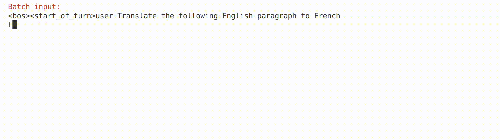
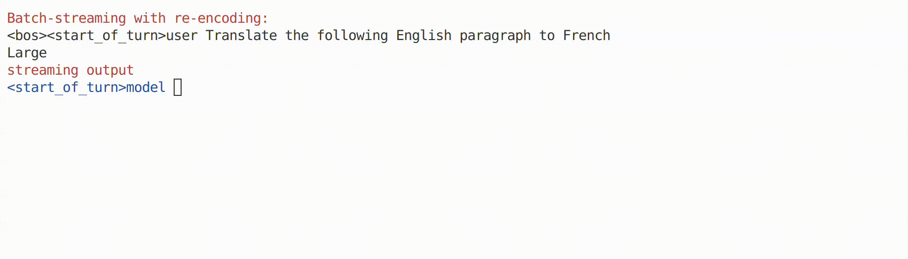
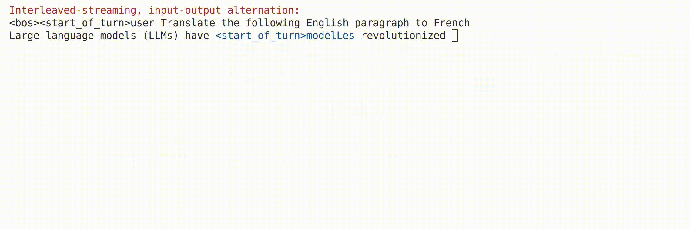
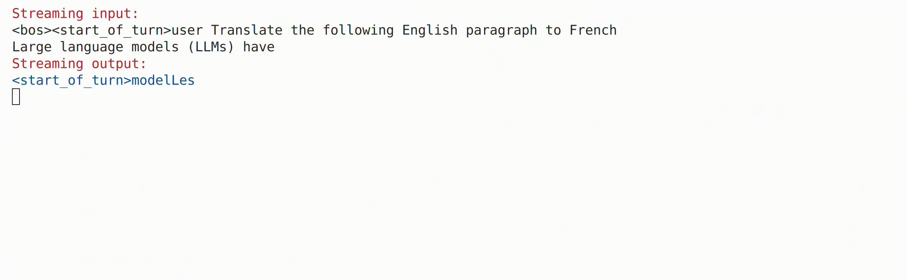
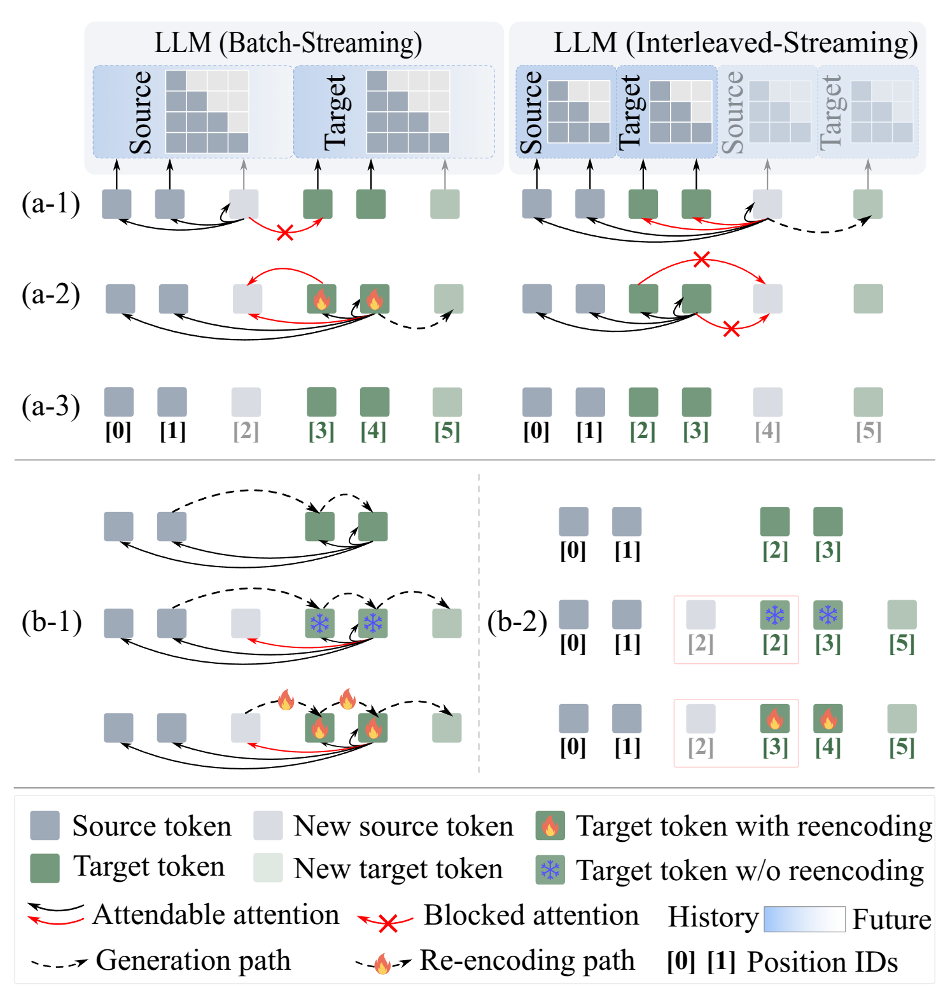
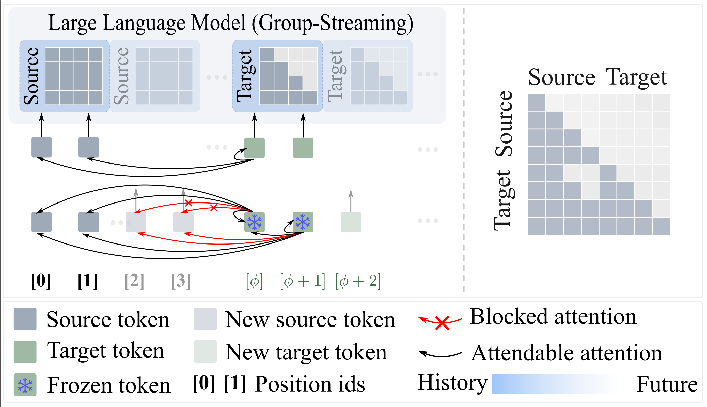

<h1 align="center"><b>[ACL 2025 Findings] LLM as Effective Streaming Processor: Bridging Streaming-Batch Mismatches with Group Position Encoding</b></h1>
</div>


<p align="center">
<a href="https://arxiv.org/abs/2505.16983" target="_blank"></a>
<a href="https://huggingface.co/JunlongTong/StreamingLLM" target="_blank"></a>

</p>


## TL;DR
We introduce a new streaming paradigm that enables large language models to achieve strong performance and generalization in streaming settings, without requiring any architectural modifications.
<!-- We introduce a new streaming paradigm that enables large language models to perform well in streaming settings, while requiring no architectural modifications. -->


## News
* [ ] Streaming speech models and additional streaming LLM implementations will be added soon.  
* [x] [05/06/2025] The code has been released.
* [x] [22/05/2025] Our paper now can be found at https://arxiv.org/abs/2505.16983.

## Batch-processing vs. streaming-processing
### batch-processing: The LLMs process inputs all at once after receiving the full sequence.

### Streaming-processing: The LLMs process the input as it arrives, incrementally and in real time.
#### Batch-streaming: 
The LLMs simulate full batch-processing by re-encoding previously generated outputs each time new input arrives, resulting in increasing latency over time.

#### Interleaved-streaming: 
The LLMs encode and generate tokens step-by-step, interleaving new input reception with ongoing decoding.

#### 💡 <span style="color:red">Our group-streaming:</span>
The LLMs process input in grouped segments, where tokens within each group are arranged in chronological order. Source and target sequences use separate positional encodings to preserve their respective temporal structures.



## Introduction
Large Language Models (LLMs) are primarily designed for batch-processing, where the entire input sequence is provided to the model at once. In contrast, human cognition operates incrementally, interpreting information as it arrives--a capability essential for real-time decision making. Bridging this gap between batch-oriented LLMs and streaming-aware processing is vital for unlocking their potential in dynamic, real-world scenarios, such as live translation, interactive dialogue systems, live streaming video understanding, and real-time decision-making systems.

Existing approaches to adapting LLMs for streaming scenarios typically fall into one of three categories: 
* (**batch-streaming**) re-encoding when new input arrival, which is computationally expensive,
* (**interleaved-streaming**) interleaving input and output contents, which adds complexity and may affect coherence,
* adopting specialized architectures, which do not scale well. 

These methods lack rigorous analysis of the fundamental discrepancies between batch and streaming processing modes. This work identifies three key mismatches in adapting batch-oriented LLMs to streaming, providing actionable insights for streaming LLM design:
* **Input-attention mismatch**: Whether the source tokens can attend to the target tokens,
* **Output-attention mismatch**: Whether the target tokens can attend to the new source token,
* **Position-ID mismatch mismatch**: Whether the position IDs reflect the actual token order.

<!--
<figure>
  
  <figcaption>Figure 1: Two streaming paradigms of LLMs: (a) Three types of mismatch between  batch-processin and interleaved-streaming paradigms. (b) The batch-streaming paradigm simulates batch-processing by re-encoding previously generated outputs.</figcaption>
</figure>
-->

<p>Among the three mismatches, we find that input-attention mismatch has the most significant impact on streaming model performance, while position ID mismatch primarily affects generalization. Based on these insights, we propose a group-streaming LLM that adheres to the batch-processing paradigm while isolating source and target position encodings. Our group-streaming paradigm is similar with batch-streaming, but do not need re-encoding.</p> 

**Our streaming paradigm is simple yet effective. It requires no architectural modifications to the LLMs, relying only on grouped positional encodings and corresponding causal masks for adaptation,** shown in the Figure 2. It supports mainstream large language models, including but not limited to [Qwen](https://huggingface.co/Qwen), [LLaMA](https://huggingface.co/meta-llama), [Gemma](https://huggingface.co/collections/google/gemma-2-release-667d6600fd5220e7b967f315), and [Phi](https://huggingface.co/collections/microsoft/phi-3-6626e15e9585a200d2d761e3).

<!--  -->

<figure>
  
  <figcaption>Figure 1: Two streaming paradigms of LLMs: (a) Three types of mismatch between  batch-processin and interleaved-streaming paradigms. (b) The batch-streaming paradigm simulates batch-processing by re-encoding previously generated outputs.</figcaption>
</figure>

<br><br>

<figure>
  
  <figcaption>Figure 2: Our group-streaming paradigm.   (Left) Positional grouping of source and target tokens in the streaming LLM, avoiding re-encoding. The target start ID φ is a hyperparameter, which can be selected as 0. (Right) The attention mask matrix during the training ensures that target tokens can only attend to  locally available inputs.</figcaption>
</figure>


## Requirements
```bash
torch >= 2.4.0
transformers == 4.44.0
peft == 0.11.1
deepspeed == 0.15.4
datasets == 2.20.0
accelerate == 0.32.1
sacrebleu == 2.4.3
ijson == 3.3.0
```

## Training
```bash
accelerate launch \
    --config_file /configs/accelerate_config.yaml \
    train.py \
    --output_dir /checkpoints \
    --epochs 1 \
    --per_bs 8 \
    --acc_steps 4 \
    --no_lora \
    --lr 5e-5 \
    --warmup_steps 3000 \
    --training_mode "streaming" \
    --split_mode "word" \
    --LLM_backbone 'Qwen' \
    --LLM_path '/LLMs/Qwen2.5-3B-Instruct'
```


## Inference
You can run `./evaluate/streaming_eval.py` for evaluation in either batch mode or group streaming mode.

## Citation
If you find this repository useful, please cite using this BibTeX:
```tex
@misc{tong2025llmeffectivestreamingprocessor,
      title={LLM as Effective Streaming Processor: Bridging Streaming-Batch Mismatches with Group Position Encoding}, 
      author={Junlong Tong and Jinlan Fu and Zixuan Lin and Yingqi Fan and Anhao Zhao and Hui Su and Xiaoyu Shen},
      year={2025},
      eprint={2505.16983},
      archivePrefix={arXiv},
      primaryClass={cs.CL},
      url={https://arxiv.org/abs/2505.16983}, 
}
```

## Contact
If you have any questions, please contact: jl-tong@sjtu.edu.cn
